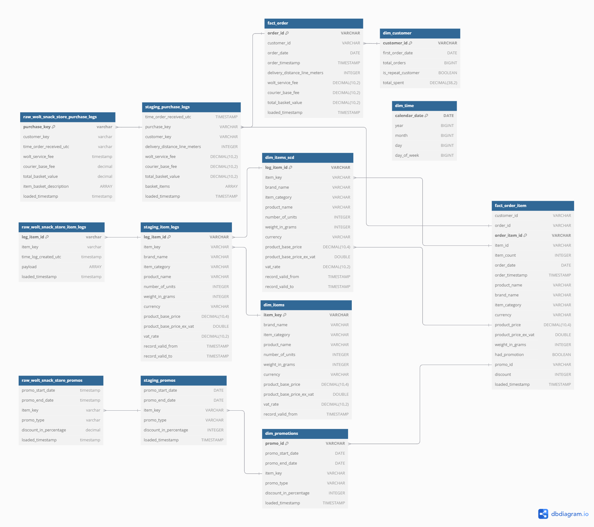

# Wolt Snack Store Interview - Data Modelling 

This model is going to be loaded using SQLMesh with DuckDB
- [Portable data stack project](https://github.com/nmirson-ml/datamesh_portable_analytics_wolt):

# Data model
 

## Layers

- `core` curated data
- `staging` staging area
- `raw` unrefined input data

### Core
*Dimensions*
- dim_customers - Master table of customer information and attributes
- dim_items - Current state of product/item catalog
- dim_items_scd - Historical changes to items over time (Slowly Changing Dimension)
- dim_promotions - Lookup table for all promotional campaigns and discounts
- dim_time - Calendar dimension for date-based analysis 

*Facts*:
- fact_order_item - Individual line items within orders (one row per item in an order)
- fact_order - Header-level order information (one row per order)

### Staging
- staging_item_logs - Intermediate table for processing item catalog changes
- staging_purchase_logs - Intermediate table for processing raw order data
- staging_promotions - Intermediate table for processing promotional data

### Raw
- raw_item_logs - Raw incoming data about item catalog changes
- raw_purchase_logs - Raw incoming data about customer purchases
- raw_promotions - Raw incoming data about promotions

## Testing
The project includes several types of tests to ensure data quality and model integrity:

### Data Quality Tests
- Column presence validation
- Data type checks 
- Not-null constraints on key fields
- Primary key uniqueness tests

### Business Logic Tests
- Fact table grain validation (e.g. one row per order in fact_order)
- SCD type 2 versioning checks in dim_items_scd
- Promotion date range validity
- Order dates falling within valid item versions
- Referential integrity between facts and dimensions

### Value Tests
- Valid ranges for numeric fields (e.g. positive prices and quantities)
- Valid formats for identifiers
- Acceptable values for categorical fields
- Date range validations

Tests are implemented using dbt's built-in testing framework and custom SQL tests. They run automatically as part of the build process to catch data quality issues early.

## Source Data
The project uses the following seed data:

### Items Log
Contains historical item data with the following key fields:
- LOG_ITEM_ID: Unique log identifier
- ITEM_KEY: Unique identifier for the item
- TIME_LOG_CREATED_UTC: Timestamp for log creation
- PAYLOAD: JSON field containing item details

### Promotions
Tracks promotional activities:
- PROMO_START_DATE: Start date of the promotion
- PROMO_END_DATE: End date of the promotion
- ITEM_KEY: Unique identifier for the item
- PROMO_TYPE: Type of the promotion
- DISCOUNT_IN_PERCENTAGE: Discount percentage

### Purchase Logs
Records customer purchases:
- TIME_ORDER_RECEIVED_UTC: Order timestamp
- PURCHASE_KEY: Primary key for the purchase
- CUSTOMER_KEY: Customer identifier
- DELIVERY_DISTANCE_LINE_METERS: Delivery distance
- WOLT_SERVICE_FEE: Service fee
- COURIER_BASE_FEE: Base delivery fee
- TOTAL_BASKET_VALUE: Total order value
- ITEM_BASKET_DESCRIPTION: JSON array of items and quantities

## Setting up the project

1. Create `.env` file to set up environment variables

`export DUCKDB_FILE_PATH='../shared/db/datamart.duckdb'`       

2. Create a empty database with duckdb using the database_init.py script:

`python database_init.py`

3. Create a Python Virtual Environment

`python3 -m venv .venv`

4. Add environment variables to the virtual environment

`cat .env >> .venv/bin/activate`

5. Activate the Python venv

`source .venv/bin/activate`

6. Install the required packages

`pip install -r requirements.txt`

## Running the dbt model

1. Ensure the virtual environment is activated

`source .venv/bin/activate`

2. Make sure you are located in the directory  `wolt_data_model`

`cd wolt_data_model`

3. Run `dbt deps` to install dependencies

4. Run `dbt seed` to import the seed (static) data

5. Run `dbt compile` to compile the project

6. Run `dbt run` to run the models

7. Run `dbt test` to run the tests

This repository is forked from [Postcard Company Datamart](https://github.com/cnstlungu/postcard-company-datamart), to be able to use DuckDB local integration with DBT. 
